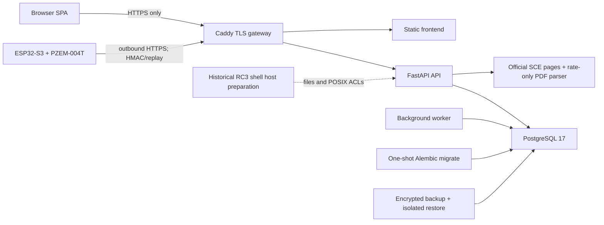

# PowerMeter V2 audit baseline

## Identity and evidence boundary

| Item | Exact baseline |
| --- | --- |
| Audit date | 2026-08-15 |
| Server commit | `0703acb265cf104674c9f54d5d65176a0b899cb3` |
| Firmware commit | `8d91cfdfbae1346e3714d9bd7abb05a16f792c66` |
| Branch created for the audit | `codex/full-repository-audit` |
| Published server evidence | signed public prerelease `v0.1.0-rc.3` |
| Shared protocol | `pm-protocol/1.0.0` |
| Starting worktrees | server and nested firmware both clean |
| Physical certification | `pending`; production gate remains closed |

The inventory made before repair contained 239 server files and 128 nested
firmware files. Generated dependencies and build outputs (`.git`,
`node_modules`, `dist`, firmware `build`, caches, databases, and binary outputs)
were excluded. Generated contracts, lockfiles, migrations, workflows, container
definitions, and release inputs were included. A timestamped inventory is also
written by `scripts/Invoke-PowerMeterFullAudit.ps1` under
`artifacts/audit/<run-id>/first-party-inventory.tsv`.

## Baseline architecture

`HostPrep` describes the immutable RC3 baseline only. It is not the repaired
normal installation design. PZEM evidence is the sole source for readings,
History, completeness, energy, forecasts, and usage-derived cost. SCE pages and
bill PDFs supply reusable rate facts only.

## Commands and retained evidence

| Evidence | Command or source | Result before repair | Retained evidence |
| --- | --- | --- | --- |
| B-01 | `npm run check` in `frontend` | exit 0; ESLint, strict TypeScript, 6 Vitest files/16 tests, production build passed | terminal transcript; baseline tree is exact server commit above |
| B-02 | `npm run test:e2e` in `frontend` | exit 0; 19/19 Chromium production-preview tests | Playwright suite and tracked reference images at the baseline commit |
| B-03 | manual production-preview DOM sweep at 320x568, 375x667, 390x844, 768x1024, 1024x768, 1280x720, 1440x900, 1920x1080 | four routes rendered; no document overflow, duplicate rendered IDs, unlabeled visible controls, or tick collision; missing points remained gaps | observations recorded during the audit; only the representative tracked screenshots below were persisted |
| B-04 | server release run | attempt 2 succeeded after an attempt-1 ARM64 QEMU failure; all mandatory gates, images, smoke, backup/restore, and assembly passed | [Actions run 31868708953 attempt 2](https://github.com/mhilton7/power-monitor-v2/actions/runs/31868708953/attempts/2) |
| B-05 | exact-commit Server CI | 8/8 jobs passed | [Actions run 31868461887](https://github.com/mhilton7/power-monitor-v2/actions/runs/31868461887) |
| B-06 | exact-commit Security | workflow passed; push-only dependency review was the expected skip | [Actions run 31868461897](https://github.com/mhilton7/power-monitor-v2/actions/runs/31868461897) |
| B-07 | public RC3 release audit | 50 assets; 49-payload checksum set; strict attestations; four two-platform digest-pinned images; zero reported Trivy vulnerabilities | [public RC3 release](https://github.com/mhilton7/power-monitor-v2/releases/tag/v0.1.0-rc.3) |
| B-08 | official SCE read-only probe on 2026-08-15 | HTML was reachable but lacked a tariff effective date and holiday rule; strict parser returned `HOLIDAY_RULE_MISSING` and retained last-known-good state | official TOU-plan and tariff-index URLs recorded in the full audit |

Tool versions used during the local audit included Git 2.55.0, Node 26.0.0,
npm 11.12.1, Python 3.13.14, and Docker Desktop Engine 29.6.1 (Linux/x86_64).
The supported local frontend was a production Vite preview backed by the
deterministic fixture API; the release smoke above is the retained real
PostgreSQL/container evidence.

## Baseline screenshot manifest

The identifiers below are Git blob IDs at the exact baseline commit, making
the image bytes reproducible without storing a second untracked copy.

| Git blob | Tracked image |
| --- | --- |
| `fd074120a622c376de22cb848a307323cc5d5f6b` | `frontend/tests/e2e/home.spec.ts-snapshots/home-reference-1680x946-desktop-linux.png` |
| `ce01bbd4d94e498a9416ff7ae5674cb5146e72d9` | `frontend/tests/e2e/home.spec.ts-snapshots/home-reference-1680x946-desktop-win32.png` |
| `7ef40e6a02a7128b1c8ae83084a70a8179ff6680` | `frontend/tests/e2e/home.spec.ts-snapshots/home-tablet-834x1112-desktop-linux.png` |
| `048db33c55981d1ec185ff710c3bace0e9eef2e7` | `frontend/tests/e2e/home.spec.ts-snapshots/home-tablet-834x1112-desktop-win32.png` |
| `fa9fa527ade181c8231ab913cc5efa44e6fecbe6` | `frontend/tests/e2e/home.spec.ts-snapshots/home-mobile-412x915-desktop-linux.png` |
| `df5e60c599f7af720e658c2543cafddf14a19b2c` | `frontend/tests/e2e/home.spec.ts-snapshots/home-mobile-412x915-desktop-win32.png` |
| `e9ac4dc3d0810eb60a8c3ddcd86289211fdc5235` | `frontend/tests/e2e/history.spec.ts-snapshots/history-mobile-412x915-desktop-linux.png` |
| `f886b4faf47772aa515c90f5791aa255cd0bdf3f` | `frontend/tests/e2e/history.spec.ts-snapshots/history-mobile-412x915-desktop-win32.png` |

## Per-feature baseline behavior

| Feature | Baseline observation | Error evidence |
| --- | --- | --- |
| Authentication | Login, owner bootstrap, CSRF/session behavior, and sign-out passed existing tests; mobile CSS hid the only sign-out action. | No browser console/page error in the sweep; mobile reachability defect was visual/source evidence. |
| Dashboard/live | Authenticated heartbeat and sequence-1 PZEM data reached the RC3 dashboard; null chart points remained discontinuous. | No release-smoke API error. Multi-home derivation could mix a selected device with another home's timezone/rate. |
| History | PZEM-only committed History rendered and survived restart in RC3 smoke. | No network failure; database lacked a complete raw-vs-permanent-loss mutual-exclusion boundary. |
| Sensors | First-device enrollment and signed heartbeat worked in RC3. | No protocol error; actor-wide home selection remained inconsistent outside the enrollment repair. |
| Rates | Stored fixture parsing and immutable publication passed. | Live official page failed closed with `HOLIDAY_RULE_MISSING`; last-known-good data was not replaced. |
| Bill import | Sanitized digital/OCR fixtures produced rate-only review drafts. | An optional encrypted-original retention path violated the stronger no-original-document persistence invariant. |
| Billing/cost | Published rates were applied to authenticated committed sensor intervals. | Multi-home overview could choose an unrelated account/rate; no bill usage entered cost. |
| Settings | Health, utility, sensor, user, and diagnostics panels rendered. | Home utility used an unordered first home; nested modal Escape/focus behavior was ambiguous. |
| Storage | RC3 exact mount/permission evidence and service readiness passed. | Normal installation still required a privileged TrueNAS shell preparation step. |
| Backups | Encrypted backup and isolated PostgreSQL restore passed in RC3 smoke. | No backup failure; UI-only host preparation was not available. |
| SCE refresh | Stored complete fixtures created review candidates. | Live incomplete evidence failed closed; no fabricated rate was created. |

During B-03 the browser console and page-error list were empty, no unexpected
failed fixture request was observed, and no backend/database exception existed
because that sweep intentionally used the deterministic fixture API. B-04 is
the baseline evidence for the real gateway/API/PostgreSQL/worker/backup stack.
The baseline did not retain a HAR or screenshots for every one of the 32
route/viewport combinations; that evidence limitation is recorded rather than
retroactively fabricating artifacts.

## Confirmed defects and reproduction anchors

| ID | Severity | Root cause / reproduction anchor | Repair direction |
| --- | --- | --- | --- |
| D-01 | Critical | Optional bill retention encrypted and persisted the entire uploaded PDF, so encryption still preserved prohibited identity/usage fields. | Remove the option and file path; enforce a database `IS NULL` constraint and fail-closed upgrade preflight. |
| D-02 | High | Dashboard and settings used unordered first-home queries while selected resources could belong to another authorized home. | Add authoritative home scopes; require exact UUID selection and exact-home query/rate derivation. |
| D-03 | High | Application locking serialized normal ingestion, but the database did not reject raw-reading/permanent-loss or overlapping-loss conflicts from direct writers. | Add migration preflight, constraints/triggers, and per-device locking. |
| D-04 | High | RC3 preparation depended on a privileged TrueNAS shell and per-file ACL commands. | Use UI-created datasets, temporary authenticated SMB staging, and a network-isolated one-shot initializer. |
| D-05 | High | The first audit runner inherited live `PM_*` variables and Docker contexts and started migration by default. | Isolate environment, prove local Docker, and require an explicit disposable-integration switch. |
| D-06 | Medium | A local Compose flow-style `tmpfs` scalar parsed as four mounts. | Quote and validate the complete mount option. |
| D-07 | Medium | Rate-source validators could advance before parsing succeeded; a later 304 could strand an unparsed revision. | Couple validators to durable parsed state and force a bounded unconditional recovery fetch when required. |
| D-08 | Medium | Logout/login retained protected React Query cache entries for another local user. | Remove every non-session query at both logout and successful authentication. |
| D-09 | Medium | Mobile sign-out, narrow modal layout, modal stack, chart metadata, and brush hit targets were incomplete. | Repair shared shell/dialog/chart primitives and add non-vacuous browser/axe tests. |
| D-10 | Low | Gitleaks pins still targeted the reviewed Node 20 action release. | Pin the reviewed Node 24 release by immutable commit. |

## Constraints carried into repair

- Never infer absent readings, rates, usage, energy, or cost.
- Never persist or expose original bill bytes or prohibited bill fields, even
  when encrypted.
- Cross-home denial must not reveal whether another home's object exists.
- TLS chain and hostname verification remain strict; no `-k` bypass exists.
- RC3 tags, assets, YAML, and digests remain immutable. Repaired source requires
  a new coordinated signed candidate.
- The initializer cannot create ZFS datasets, rotate secrets, retain network
  access, or remain running after successful preparation.
- Hardware certification remains pending until actual marked-unit HIL evidence
  exists.
